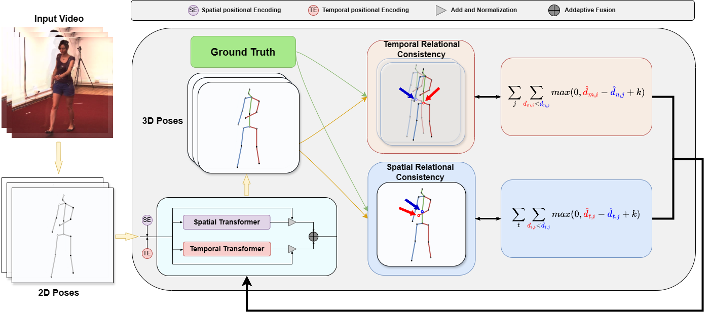

 # 
 [ECCV 2024] RePOSE: 3D Human Pose Estimation via Spatio-Temporal Depth Relational Consistency

---
>**RePOSE: 3D Human Pose Estimation via Spatio-Temporal Depth Relational Consistency**   [Ziming Sun](https://orcid.org/0009-0001-8515-9189)†, [Yuan Liang](https://orcid.org/0000-0002-0942-9781)†, [Zejun Ma](https://orcid.org/0009-0002-9536-5231), [Tianle Zhang](https://orcid.org/0009-0009-4467-5863), [Linchao Bao](https://orcid.org/0000-0001-9543-3754), [Guiqing Li](https://orcid.org/0000-0002-4598-1522), [Shengfeng He](http://www.shengfenghe.com/)*  
(† Equal Contribution, * Corresponding Author) 
>The 18th European Conference on Computer Vision ECCV 2024

> **Abstract:** *We introduce RePOSE, a simple yet effective approach for addressing occlusion challenges in the learning of 3D human pose estimation (HPE) from videos. Conventional approaches typically employ absolute depth signals as supervision, which are adept at discernible keypoints but become less reliable when keypoints are occluded, resulting in vague and inconsistent learning trajectories for the neural network. RePOSE overcomes this limitation by introducing spatio-temporal relational depth consistency into the supervision signals. The core rationale of our method lies in prioritizing the precise sequencing of occluded keypoints. This is achieved by using a relative depth consistency loss that operates in both spatial and temporal domains. By doing so, RePOSE shifts the focus from learning absolute depth values, which can be misleading in occluded scenarios, to relative positioning, which provides a more robust and reliable cue for accurate pose estimation. This subtle yet crucial shift facilitates more consistent and accurate 3D HPE under occlusion conditions. The elegance of our core idea lies in its simplicity and ease of implementation, requiring only a few lines of code. Extensive experiments validate that RePOSE not only outperforms existing state-of-the-art methods but also significantly enhances the robustness and precision of 3D HPE in challenging occluded environments.*
---

## News
Our code will be released soon!
